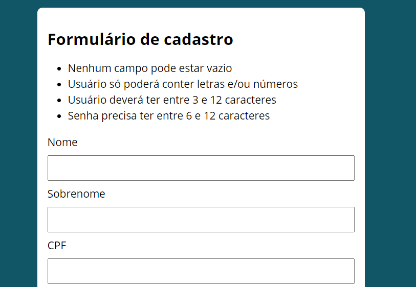
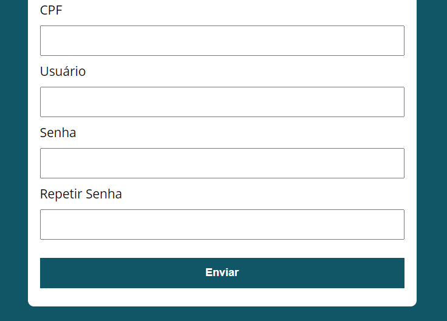
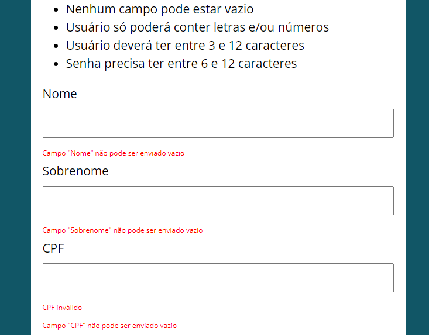

# validador_de_formulario
Esse projeto utiliza do conceito de classe do JavaScript para simular regras para validação do formulário.

## Minha aplicação:

## Sobre a aplicação:

O sistema usa o conceito de classe do Javascript para modularizar o código o tornando mais organizado e intuitivo,
nesse projeto temos uma classe responsável apenas por validar o número de CPF preenchido em um campo conferindo se os
2 últimos dígitos estão de acordo com as regras para sua geração. Feito isso, os outros métodos da nossa classe principal são responsáveis por
validar os outros campos e mostrar os critérios de cada campo para o usuário.

## Por que esse projeto?

Além de me possibilitar praticar o conceito de classe no JavaScript, ele adiciona para meu portfólio uma funcionalidade comum diversos sistemas.
